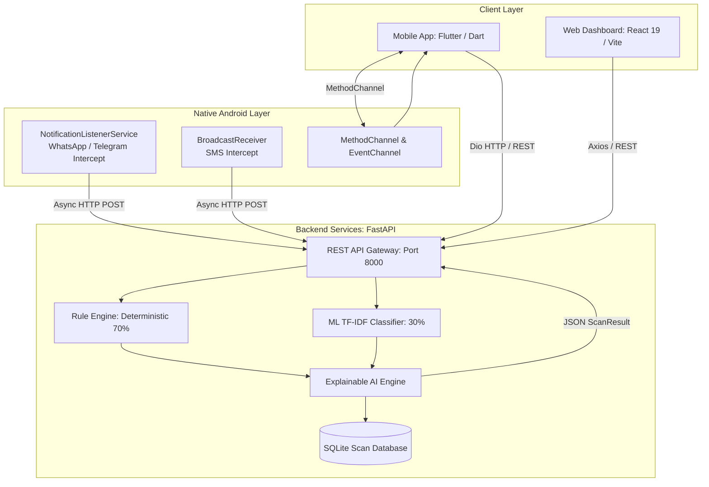
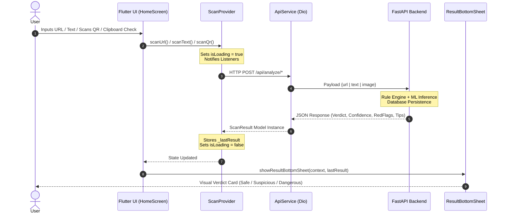
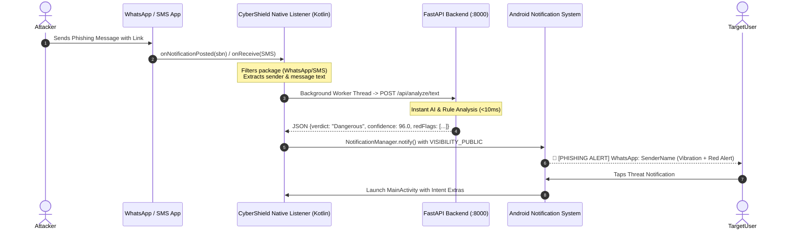
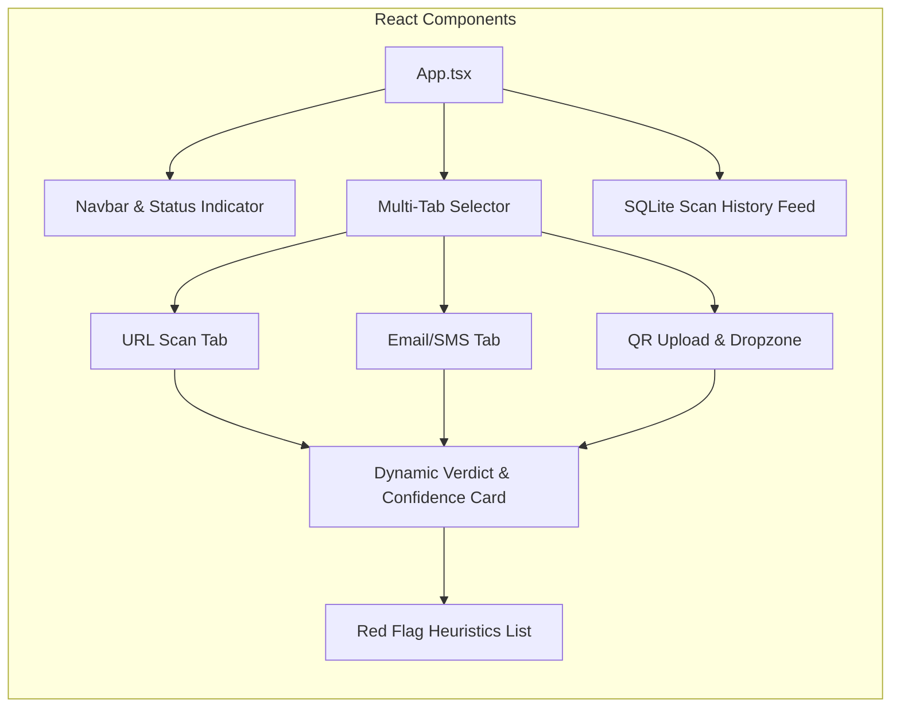

# 🛡️ CyberShield Frontend — Technical Architecture & Presentation Guide

---

## 1. System Architecture Overview

CyberShield features a **Dual-Frontend Architecture**:
1. **Flutter Mobile Application** (Android Native Interceptors + Dart UI)
2. **React 19 Web Dashboard** (Vite + Tailwind CSS)

Both frontends communicate with a centralized **FastAPI AI Backend** over REST APIs.



---

## 2. Mobile App Architecture (Flutter & Dart)

### Tech Stack Summary
| Component | Technology | Role |
|---|---|---|
| **Framework** | Flutter 3.44+ / Dart | Cross-platform UI Rendering |
| **State Management** | `Provider` (`ChangeNotifier`) | Reactive scan state, error, loading, history |
| **Networking** | `Dio` (v5.7.0) | HTTP requests, timeout handling, dynamic IP interceptor |
| **Camera & QR** | `mobile_scanner` (v6.0.4) | Hardware camera feed & real-time barcode decoding |
| **Styling & Fonts** | `GoogleFonts` (Outfit), `Flutter Animate` | Dark Cyber Glassmorphic Theme |
| **Persistence** | `SharedPreferences` | Dynamic backend server IP storage |
| **Native Integration**| Kotlin MethodChannel & EventChannel | Runtime permissions & background service bridging |

---

### End-to-End User Flow (Mobile UI)



---

### Real-Time Background Interception Flow (WhatsApp & SMS)



---

## 3. Flutter Folder & Component Structure

```
lib/
├── main.dart                      # App entry point, MultiProvider setup, Dark Theme init
│
├── core/
│   └── app_theme.dart             # Color constants: Background (#0F172A), Primary (#06B6D4),
│                                  # Success (#10B981), Warning (#F59E0B), Error (#EF4444)
├── models/
│   └── scan_result.dart           # Data classes: ScanResult, RedFlag with null-safe JSON parsing
│
├── providers/
│   └── scan_provider.dart         # Business logic & reactive state management
│
├── screens/
│   ├── home_screen.dart           # Dashboard: Active Shield Banner, 1-Tap WhatsApp Shield,
│   │                              # 3 Core Scan Tools Grid, Clipboard Quick Scan
│   ├── analyze/
│   │   ├── url_scan_screen.dart   # URL input with protocol prefixing & DNS check
│   │   ├── text_scan_screen.dart  # Multi-line email / SMS text input
│   │   └── qr_scan_screen.dart    # Live camera view with bounding box overlay
│   ├── history/
│   │   └── history_screen.dart    # ListView of previous scans fetched from backend SQLite
│   └── settings/
│       └── settings_screen.dart   # Backend IP configuration for local WiFi adaptation
│
├── services/
│   ├── api_service.dart           # Dio HTTP client with interceptor for dynamic base URLs
│   ├── permission_service.dart    # MethodChannel wrapper for Notification Access & SMS perms
│   └── sms_watcher_service.dart   # EventChannel stream listener for foreground SMS alerts
│
└── widgets/
    └── result_bottom_sheet.dart   # Modal popup displaying verdict, confidence meter,
                                   # Red Flag tags, Explanation, and Actionable Safety Tips
```

---

## 4. Key UI Features & Engineering Highlights

### 1. Dynamic 1-Tap Notification Shield (`home_screen.dart`)
- **Challenge**: Android restricts background notification reading for privacy.
- **Solution**: The UI dynamically detects if `NotificationListenerService` is authorized (`PermissionService.isNotificationAccessGranted()`). If inactive, it displays an alert card with a **1-Tap Enable Button** directing users to `android.settings.ACTION_NOTIFICATION_LISTENER_SETTINGS`.

### 2. Clipboard Quick Check
- Allows users to scan copied URLs or message snippets directly from the system clipboard with 1 tap, avoiding manual copy-paste into textfields.

### 3. Explainable AI (XAI) Bottom Sheet (`result_bottom_sheet.dart`)
- Rather than giving a blind score, the UI provides:
  - **Verdict Badge**: Color-coded (`Safe` = Green, `Suspicious` = Amber, `Dangerous` = Red).
  - **Confidence Gauge**: Quantified ML + Rule engine agreement score.
  - **Red Flags Detected**: Individual breakdown of failed security heuristics (e.g., *Typosquatting*, *Missing HTTPS*, *Suspicious TLD*, *Urgency Language*).
  - **Safety Action Items**: Concrete steps for non-technical users (e.g., *"Do not enter credentials"*, *"Report as spam"*).

---

## 5. Web Frontend Architecture (React 19 + Vite)



### Web Highlights:
- **Fast Build System**: Built with Vite 6 for sub-second hot module replacement (HMR).
- **Tailwind CSS**: Sleek dark cybersecurity theme matching the mobile aesthetic.
- **Drag-and-Drop QR Upload**: HTML5 file dropzone supporting instant browser-side QR processing.
- **Unified REST API**: Mobile and Web share the exact same backend endpoints.

---

## 6. API Data Contracts

### 1. Text / SMS Scan (`POST /api/analyze/text`)
**Request Body:**
```json
{
  "text": "URGENT: Your account is suspended. Verify credentials: http://paypal-update.xyz/login",
  "type": "sms"
}
```
**Response Body:**
```json
{
  "id": 12,
  "verdict": "Dangerous",
  "confidence": 96.0,
  "redFlags": [
    {
      "rule_id": "urgency_language",
      "description": "Contains urgency/pressure language: 'account suspended'.",
      "severity": "high"
    },
    {
      "rule_id": "link_typosquatting",
      "description": "Embedded Link (http://paypal-update.xyz/login): Domain contains 'paypal' but appears to be a deceptive imitation.",
      "severity": "high"
    },
    {
      "rule_id": "link_suspicious_tld",
      "description": "Embedded Link (http://paypal-update.xyz/login): Domain uses a top-level domain frequently associated with spam (.xyz).",
      "severity": "medium"
    }
  ],
  "explanation": "- Contains urgency/pressure language: 'account suspended'.\n- Embedded Link (http://paypal-update.xyz/login): Domain contains 'paypal' but appears to be a deceptive imitation.",
  "recommendation": "Do not proceed. This is highly likely to be a threat.",
  "tips": [
    "Block the sender's number on your phone.",
    "Do not tap on the link.",
    "Report the message as spam to your carrier."
  ]
}
```

---

## 7. Hackathon Defense & Presentation Script (For Your Teammate)

### 🎙️ 2-Minute Elevator Pitch
> *"Good morning judges. Today, most phishing detection tools require users to manually copy and paste suspicious links into a website. But by then, it's often too late — users have already clicked or trusted the message.*
>
> *With **CyberShield**, we built a **real-time, zero-friction protection engine**. Our Flutter mobile frontend integrates natively with the Android OS via a Kotlin `NotificationListenerService`. The moment a phishing link arrives via **WhatsApp, Telegram, or SMS**, CyberShield intercepts the notification in the background, scans it against our hybrid AI engine in under 10 milliseconds, and raises an immediate, high-priority alert on the lock screen.*
>
> *For power users and desktop environments, we also offer a responsive **React 19 Web Dashboard** with live DNS validation, QR dropzone scanning, and an incident reporting history."*

---

### 💡 Top 5 Judge Questions & Technical Answers

| # | Question | Ideal Technical Answer |
|---|---|---|
| **1** | **Why did you choose Flutter over native Android/Kotlin for the entire app?** | *"Flutter provides rapid UI rendering with 60fps performance and cross-platform flexibility. However, for platform-specific hardware and OS events (like SMS interception and notification listening), we implemented native Kotlin bridges using `MethodChannel` and `EventChannel`, achieving the best of both worlds."* |
| **2** | **How does the app handle network latency and offline scenarios?** | *"Our `Dio` networking service is wrapped with a 5-second timeout and dynamic connection interceptor. If the backend is temporarily unreachable, the app gracefully falls back to displaying cached scan results and descriptive error messages rather than hanging or crashing."* |
| **3** | **How do you prevent 'Content Hidden' on Android notifications?** | *"Android lockscreens treat third-party notification content as sensitive by default. In our native Kotlin service, we explicitly set `Notification.VISIBILITY_PUBLIC` on the builder and configured `lockscreenVisibility = Notification.VISIBILITY_PUBLIC` on the notification channel."* |
| **4** | **What state management pattern did you use and why?** | *"We used **Provider (`ChangeNotifierProvider`)**. It separates UI rendering from business logic cleanly. `ScanProvider` handles asynchronous API orchestration, loading indicators, error states, and history synchronization reactively."* |
| **5** | **How does your UI support Explainable AI (XAI)?** | *"Rather than outputting a black-box score, our `ResultBottomSheet` breaks down the decision into deterministic Red Flag heuristics (e.g. DGA domains, TLD abuse, Typosquatting) paired with the statistical ML confidence and actionable safety guidelines."* |
